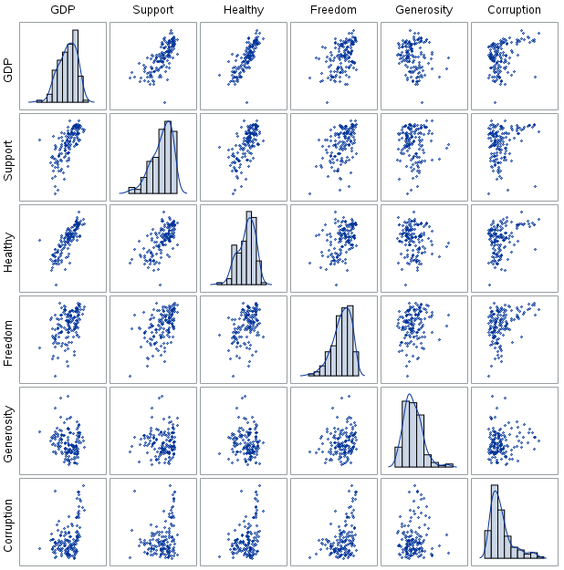
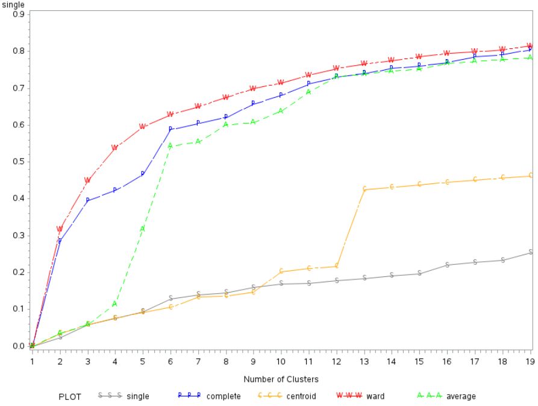

## Introduction

* What is WHR?
* What are the 6 chars of WHR?
* Basic top/btm results from 2022

our happiness rankings are not based on any index of these six factors—the scores are instead based on individuals’ own assessments of their lives, as revealed by their answers to the single-item Cantril ladder life-evaluation question.

We use observed data on the six variables and estimates of their associations with life evaluations to explain the observed variation of life evaluations across countries:

<font size="2">

- **Gross Domestic Product (GDP) per Capita:** Purchasing Power Parity (PPP) adjusted to constant 2017 international dollars, taken from the World Development Indicators (WDI) released by the World Bank on December 16, 2021. after adjustment for population growth. The equation uses the natural log of GDP per capita, as this form fits the data significantly better than GDP per capita.

- **(Healthy) Life Expectancy:** is constructed based on data from the World Health Organization (WHO) Global Health Observatory data repository, with data available for 2000, 2010, 2015, and 2019 (extrapolation to 2021). 

The following items are based on the national average of the binary responses (0=no, 1=yes) to the Gallup World Poll (GWP) questions:

- **Social (Support):** “If you were in trouble, do you have relatives or friends you can count on to help you whenever you need them, or not?”

- **(Freedom):** “Are you satisfied or dissatisfied with your freedom to choose what you do with your life?”

- **(Generosity):** “Have you donated money to a charity in the past month?” on log GDP per capita.

- **Perceptions of (Corruption):** the average of the two GWP questions: 
  - “Is corruption widespread throughout the government in this country or not?”  
  - “Is corruption widespread within businesses in this country or not?” 
  - Perception of business corruption is used when government corruption is missing.

</font>


Countries with a * do not have survey results from 2020 or 2021. There averages are based on the 2019 survey.


The goal of this analysis is to cluster countries into different groups based on their results from the 2022 World Happiness Report. And garner 


## Descriptive Statistics
Figure 1 and Table 1 present the boxplot and summary statistics (respectively) of each variable from the original dataset. There are no missing data, the variables are not on same scale, and each variable contains at least one outlier. The summaries also show that the variance of `GDP` differs substantially from the other variables. As such, the data was standardized before performing the cluster analysis so that each variable has a mean of zero and standard deviation (SD) of one.

The code below creates the summary statistics table in SAS.
```
PROC MEANS DATA=dataset MEAN STD VAR NMISS N maxdec=2;
	VAR GDP Support Healthy Freedom Generosity Corruption;
RUN;
```
<font size="2">
```{r, echo=FALSE, results='asis'}

tab <- matrix(c(1.41,	0.91,	0.59,	0.52,	0.15,	0.15,
                0.42,	0.28,	0.18,	0.15,	0.08,	0.13,
                0.18,	0.08,	0.03,	0.02,	0.01,	0.02), 
              ncol=6, byrow=TRUE)

colnames(tab) <- c('GDP','Support','Healthy','Freedom','Generosity','Corruption')
rownames(tab) <- c('Mean','SD','Variance')

tab <- as.table(tab)

knitr::kable(tab, align='cccccc', caption = "Table 1. Mean, Standard Deviation (SD), & Variance of Each Variable.")
```
</font>

The following code is used to standardize the data.
```
PROC STDIZE DATA=dataset OUT=dataset_std METHOD=std;
	VAR GDP Support Healthy Freedom Generosity Corruption;
RUN;
```

To create the boxplot, the wide dataset was transposed into a long dataset based on the happiness rank and the long & short names of each country. The indices of interest are collected into the variable `category`, and their associated value per country is under the `value` variable.

```
PROC TRANSPOSE DATA=dataset_std OUT=dataset_long;
   VAR Happiness GDP Support Healthy Freedom Generosity Corruption;
   BY  Rank Country CNTRY;
RUN;


DATA dataset_long;
  SET  dataset_long (RENAME=(col1=value));
  SET  dataset_long (RENAME=(_LABEL_=category));
  DROP COL1;
  DROP _name_;
  DROP _LABEL_;
RUN; 
```

With this new dataset a boxplot can be created.
```
PROC SGPLOT DATA=dataset_long; VBOX value / GROUP=category; RUN;
```
<font size="2">
```{r, echo=FALSE, out.width="49%", out.height="20%", fig.cap="Figure 1. Boxplots of Each Variable Before (left) & After (right) Standardization.", fig.show='hold', fig.align='center'}
knitr::include_graphics(c("../Images/boxplot.png","../Images/std_boxplot.png"))
``` 
</font>

### Correlation Analysis

The pearson correlation (r) matrix and bivariate scatter plots are also analyzed to see if any there are any significant correlations between the variables of interest. Although there are no universal rules for interpreting coefficients, Cohen’s<sup>5</sup> recommended guidelines state the following: 

**Cohen J: Statistical Power Analysis for the Behavioral
Sciences. 2nd ed. Hillsdale, NJ, Lawrence Erlbaum, 1988.**

- $|r| < 0.3 →$ Weak relationship
- $0.3 ≤ |r| ≤ 0.5 →$ Moderate relationship
- $|r| > 0.5 →$ Strong relationship

As such all bivariate relationships are summarized in TABLE XXX. 

The strongest positive correlations are between `GDP` versus `Support` & `Healthy`. Indicating that countries with higher GDPs usually have more people with social structures of support among friends & relatives; and citizens from higher GDP countries tend to have a higher life expectancy. `Freedom` is moderately correlated with most variables. `Generosity` is weakly correlated with all variables (i.e., countries where many people donate to charity aren't associated with other indicators of happiness). 

<font size="2">
```{r, echo=FALSE, results='asis'}

tab <- matrix(c('Support, Healthy',   'Healthy',  '',                    '',          '',
                'Freedom, Corruption','Freedom',  'Freedom, Corruption', 'Corruption','',
                'Generosity','Generosity, Corruption','Generosity','Generosity','Corruption'), 
              ncol=5, byrow=TRUE)

colnames(tab) <- c('GDP','Support','Healthy','Freedom','Generosity')
rownames(tab) <- c('Strong','Moderate','Weak')

tab <- as.table(tab)

knitr::kable(tab, align='ccccc', caption = "Table XX. Correlated Variables.")
```
</font>


```
PROC CORR DATA=dataset_std;
    VAR GDP Support Healthy Freedom Generosity Corruption;
RUN;

PROC SGSCATTER DATA=dataset_std;
   MATRIX GDP Support Healthy Freedom Generosity Corruption / 
   DIAGONAL=(KERNEL HISTOGRAM);
RUN;
```

<font size="2">
```{r, echo=FALSE, results='asis'}

tab <- matrix(c(1,	    0.7224,	0.8155,	0.4585,-0.1645,	0.3779,
                0.7224,	1,	    0.6667,	0.4802,-0.0024,	0.2235,
                0.8155,	0.6667,	1,	    0.433,-0.0981,	0.3625,
                0.4585,	0.4802,	0.433,	1,	    0.1766,	0.4024,
               -0.1645,-0.0024,-0.0981,	0.1766,	1,	    0.0951,
                0.3779,	0.2235,	0.3625,	0.4024,	0.0951,	1
), 
              ncol=6, byrow=TRUE)

colnames(tab) <- c('GDP','Support','Healthy','Freedom','Generosity','Corruption')
rownames(tab) <- c('GDP','Support','Healthy','Freedom','Generosity','Corruption')

tab <- as.table(tab)

knitr::kable(tab, align='cccccc', caption = "Table XX. Pearson Correlation Coefficient Matrix.")
```
```{r, echo=FALSE, out.width="49%", out.height="20%", fig.cap="Figure XX. Bivariate Scatter Plot.", fig.show='hold', fig.align='center'}

```
</font>


## Assumptions 
The Euclidean distance is for each cluster analysis method.

## Agglomerative Hierarchical Clustering

### Methods

This clustering method starts by defining each data point as a cluster. Then, the two closest clusters are combined into a new cluster. In each subsequent step, two existing clusters are merged into a single cluster based on their inter-cluster distance. This distance can be defined using one of five methods: 1) Single Linkage, 2) Compelte Linkage, 3) Centroid Method, 4) Average Linkage, and 5) Ward's Error.

The SAS macro below is used to conduct the clustering and create the dendrogram (tree) plots shown in FIGUREXXX.
```
%MACRO AgglomCluster(ds, clustMethod, OutName);
	PROC CLUSTER DATA=&ds METHOD=&clustMethod RSQ NOSQUARE NONORM NOEIGEN out=&OutName; 
		VAR Happiness GDP Support Healthy Freedom Generosity Corruption; 
		ID CNTRY; 
	PROC SORT; BY _ncl_;
	
	PROC TREE DATA=&OutName; ID CNTRY;                   * Create dendrograms;
	DATA &OutName; SET &OutName; &clustMethod = _rsq_;   * Adding R sq values for each method to new variable;
	RUN;
%MEND AgglomCluster;
```

The %AgglomCluster macro above is wrapped into the macro below which allows one to loop through each distance method and obtain the cluster analysis results for each method. 
```
%let param1 = single    complete    centroid    ward    average;     * distance method options;
%let param2 = singleout completeout centroidout wardout averageout;  * Cluster analysis output datasets;
%macro loop();
    %do i=1 %to %sysfunc(countw(&param1,%str( )));
        %let thisparam1=%scan(&param1,&i,%str( ));
        %let thisparam2=%scan(&param2,&i,%str( ));
        %put &thisparam1 &thisparam2;
        %AgglomCluster(dataset_std, &thisparam1, &thisparam2);
    %end;
%mend loop;
%loop;
```

Figure XXX illustrates the dendrograms of the five clustering methods. Using the distance (height) between clusters, we can see that the complete and Ward’s error methods suggest a solution of 3 or 4 clusters (perhaps 5 for the Ward's error). The single linkage noticeably suffers from the chaining effect, and the centroid & average methods do not yield clear clustering patterns.

<font size="2">
```{r, echo=FALSE, out.width="35%", out.height="15%", fig.cap="FIGURE XX. Cluster Dendrograms of the Five Methods.", fig.show='hold', fig.align='center'}
knitr::include_graphics(c("../Images/single_tree_new.png","../Images/complete_tree_new.png","../Images/centroid_tree_new.png","../Images/ward_tree_new.png","../Images/average_tree_new.png"))
``` 
</font>


Figure XXX plots the R<sup>2</sup> values of the different cluster solutions from the five methods. The Ward’s error, complete, and average linkage methods yield much better R<sup>2</sup> values compared to the single linkage or the centroid methods. 

XXX
The Ward’s error method seems to capture information the best with an R<sup>2</sup> value of about XXX0.75, 0.66, 0.50 with 10, 7, and 4 clustersXXX, respectively. For a cluster size of 7 or above, the change in the R<sup>2</sup> value seems to flatten out, indicating that adding new clusters will only provide a small increase to the overall R<sup>2</sup>. For the solutions with less than 7 clusters, four clusters seem to result in the reasonable decrease in R<sup>2</sup> (R^2 = 0.50). A 10-cluster solution also seems to be worth examining since this is when the RMS Standard Deviation approaches 1, which decreases from smaller than 1.5 with 4 clusters and 1.32 with 7 clusters but increases to 1.12 with 11 clusters.
XXXX

The complete and average linkage methods follow close behind in terms of the R<sup>2</sup> statistics, but the single linkage and the centroid methods seem to perform much worse. 

The R<sup>2</sup> value for complete linkage increases drastically when the cluster size changes from 2 to 3 and from 5 to 6. The average linkage has the biggest R<sup>2</sup> increase out of all methods when the cluster size changes from 4 to 6. A smaller increases occur at 7 to 8.


There are sharp increases in R<sup>2</sup> when the number of clusters increases from 9 to 10 and from 12 to 13 for the centroid method. However, there are no sharp increase for the single linkage method.

```
*Merging all output datasets for all methods into one dataset sorted by the # of clusters;
DATA outputs; MERGE singleout completeout centroidout wardout averageout; BY _ncl_;
DATA outputs; SET outputs; IF _ncl_ <20;

symbol1 i = join v = S l = 1  c = gray; 
symbol2 i = join v = P l = 5  c = blue;
symbol3 i = join v = C l = 10 c = orange; 
symbol4 i = join v = W l = 15 c = red;
symbol5 i = join v = A l = 20 c = CX00FF00;

PROC GPLOT DATA = outputs;
PLOT single*_ncl_=1 complete*_ncl_=2 centroid*_ncl_=3 ward*_ncl_=4 average*_ncl_=5 /OVERLAY LEGEND;
RUN;
```

```{r, echo=FALSE, out.width="65%", fig.cap="R<sup>2</sup> Plots for the Five Different Methods.", fig.show='hold', fig.align='center'}

``` 

### Interpretation 


## K-Means

### Methods

Since several variables are correlated with one another, the typical measures used to evaluate the k-means clustering models, i.e., the Cubic Clustering Criterion (CCC) and overall R[^2], cannot be used. To use them, a principal component analysis (PCA) must be performed to obtain orthogonal axes before conducting the k-means cluster analysis.


### Interpretation 

## Conclusion 

Discuss which model chosen and why

`html_pretty` in the
[**prettydoc**](https://github.com/yixuan/prettydoc/) package is a new
output format for creating HTML documents from R Markdown files.
`html_pretty` is more lightweight compared to `html_document`, and is
more stylish than `html_vignette` when creating package vignettes.

```
library(SASmarkdown)
```


## New Styles

`html_pretty` currently supports three page themes (`cayman`, `tactile`
and `architect`), and two syntax highlight styles (`github` and
`vignette`). The theme and highlight styles can be specified in the
document metadata, for example:

``` yaml
output:
  prettydoc::html_pretty:
    theme: architect
    highlight: github
```

## Your Familiar Tools

Feel free to use the `knitr` infrastructure with dozens of tunable
options in your document.

```{r fig.width=6, fig.height=6, fig.align='center'}
set.seed(123)
n <- 1000
x1  <- matrix(rnorm(n), ncol = 2)
x2  <- matrix(rnorm(n, mean = 3, sd = 1.5), ncol = 2)
x   <- rbind(x1, x2)
head(x)
smoothScatter(x, xlab = "x1", ylab = "x2")
```

You can include code snippets of languages other than R, but note that
the block header has no curly brackets around the language name.

``` cpp
// [[Rcpp::export]]
NumericVector timesTwo(NumericVector x) {
    return x * 2;
}
```

You can also write math expressions, e.g. $Y = X\beta + \epsilon$,
footnotes[^1], and tables, e.g. using `knitr::kable()`.

[^1]: A footnote here.

```{r, echo=FALSE, results='asis'}
knitr::kable(head(iris, 10))
```

## Stay Tuned

Please visit the [development
page](https://github.com/yixuan/prettydoc/) of the `prettydoc` package
for latest updates and news. Comments, bug reports and pull requests are
always welcome.
