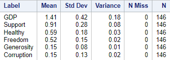
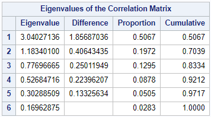
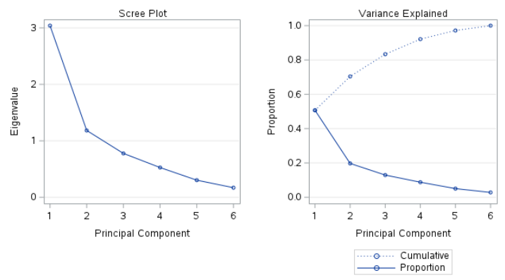

# Introduction

The [World Happiness Report (WHR)](https://worldhappiness.report/) uses survey data to describe how people evaluate their own lives in various countries around the world. Happiness is measured by asking survey participants to respond to the following question:

-   `Happiness:` "Please imagine a ladder, with steps numbered from 0
    at the bottom to 10 at the top. The top of the ladder represents the
    best possible life for you and the bottom of the ladder represents
    the worst possible life for you. On which step of the ladder would
    you say you personally feel you stand at this time?"

The WHR uses external observational data on the following six life
factors to estimate their association with happiness and to explain the
observed variation of happiness across countries.

-   `Gross Domestic Product (GDP) per Capita:` Log GDP per Capita in purchasing power          parity. Constant 2017 international dollar prices from World Development Indicators        (WDI).

-   `(Healthy) Life Expectancy:` is constructed based on data from the
    World Health Organization (WHO) Global Health Observatory data
    repository.

The following items are based on the national average of the binary
responses (No = 0, Yes = 1) to the Gallup World Poll (GWP) questions:

-   `Social (Support):` "If you were in trouble, do you have relatives
    or friends you can count on to help you whenever you need them, or
    not?"

-   `(Freedom):` "Are you satisfied or dissatisfied with your freedom
    to choose what you do with your life?"

-   `(Generosity):` "Have you donated money to a charity in the past
    month?" on log GDP per Capita.

-   `Perceptions of (Corruption):` the average of the two GWP
    questions:

    -   "Is corruption widespread throughout the government in this
        country or not?"
    -   "Is corruption widespread within businesses in this country or
        not?"
    -   Perception of business corruption is used when government
        corruption is missing.

The goal of this analysis is to cluster countries into different groups
based on their results from the 2022 World Happiness Report and describe
how the groups differ from one another.


# Exploratory Data Analysis


## Summary Statistics

Figure 1 and Table 1 present the boxplot and summary statistics
(respectively) of each variable from the original dataset. There are no
missing data, the variables are not on same scale, and each variable
contains at least one outlier. The summaries also show that the variance
of `GDP` differs substantially from the other variables. As such, the
data was standardized before performing the cluster analysis so that
each variable has a mean of zero and standard deviation (Std Dev) of one.

The code below creates the summary statistics table in SAS.

```
PROC MEANS DATA=dataset MEAN STD VAR NMISS N maxdec=2;
  VAR GDP Support Healthy Freedom Generosity Corruption;
RUN;
```
<font size="2">
```{r, echo=FALSE, out.width="35%", fig.cap="Table 1. Summary Statistics & Counts (N).", fig.show='hold', fig.align='center'}

```
</font>


The following code is used to standardize the data.
```
PROC STDIZE DATA=dataset OUT=dataset_std METHOD=std;
  VAR GDP Support Healthy Freedom Generosity Corruption;
RUN;
```


## Boxplots

To create the boxplot, the wide dataset was transposed into a long
dataset based on the happiness rank and the long & short names of each
country. The indices of interest are collected into the variable
`category`, and their associated value per country is under the `value`
variable.
```
PROC TRANSPOSE DATA=dataset OUT=dataset_long;
   VAR GDP Support Healthy Freedom Generosity Corruption;
   BY Rank Country CNTRY;
RUN;

DATA dataset_long;
  SET dataset_long (RENAME=(col1=value));
  SET dataset_long (RENAME=(_LABEL_=category));
  DROP COL1;
  DROP _name_;
  DROP _LABEL_;
RUN; 
```

With this new dataset, a boxplot can be created.
```
PROC SGPLOT DATA=dataset_long; VBOX value / GROUP=category; RUN;
```
<font size="2">
```{r, echo=FALSE, out.width="49%", out.height="20%", fig.cap="Figure 1. Boxplots of Each Variable Before (left) & After (right) Standardization.", fig.show='hold', fig.align='center'}
knitr::include_graphics(c("images/boxplot.png",
                          "images/std_boxplot.png"))
```
</font>


## Correlation Analysis

The pearson correlation (r) matrix (Table 2, [code source](https://blogs.sas.com/content/graphicallyspeaking/2017/12/11/displaying-upper-lower-triangle-correlation-matrix/)) and bivariate scatter plot (Figure 2) are also
analyzed to see if any there are any significant correlations between
the variables of interest. Although there are no universal rules for
interpreting coefficients, [Cohen's](https://doi.org/10.4324/9780203771587) recommended guidelines
state the following:

-   \|r\| \< 0.3 → Weak relationship
-   0.3 ≤ \|r\| ≤ 0.5 → Moderate relationship
-   \|r\| \> 0.5 → Strong relationship

```
* Correlation matrix;
PROC CORR DATA=dataset_std;
  VAR GDP Support Healthy Freedom Generosity Corruption;
  ods output PearsonCorr=p;
RUN;

* Obtain lower triangle of corr matrix; 
DATA p2;
  SET p END=__eof;
  ARRAY __n[*] _NUMERIC_;
  DO __i = _n_ TO dim(__n); __n[__i] = ._; END;
  IF _n_ = 1 THEN DO;
    CALL execute('data _null_; set p2;');
    CALL execute('file print ods=(template="Base.Corr.StackedMatrix"');
    CALL execute('columns=(rowname=variable');
  END;
	CALL execute(CATS('matrix=',VNAME(__n[_n_]),'(generic)'));
	IF __eof THEN CALL execute(')); put _ods_; run;');
RUN;

* Bivariate plots;
PROC SGSCATTER DATA=dataset_std;
	MATRIX GDP Support Healthy Freedom Generosity Corruption / 
	DIAGONAL=(KERNEL HISTOGRAM);
RUN;
```

<font size="2">
```{r, echo=FALSE, out.width="49%", out.height="20%", fig.cap="Table 2. Pearson Correlation Matrix.", fig.show='hold', fig.align='center'}
knitr::include_graphics("images/corr_matrix_lower_triangle.png", dpi = NA)
```
```{r, echo=FALSE, out.width="49%", out.height="20%", fig.cap="Figure 2. Bivariate Scatter Plot.", fig.show='hold', fig.align='center'}
knitr::include_graphics("images/corr_plot.png", dpi = NA)
```
</font>


All bivariate relationships are summarized in Table 3. The strongest 
positive correlations are between `GDP` versus `Support` & `Healthy`. 
Indicating that countries with higher GDPs usually have more
people with social structures of support among friends & relatives; and
citizens from higher GDP countries tend to have a higher life
expectancy. `Freedom` is moderately correlated with most variables.
`Generosity` is weakly correlated with all variables (i.e., countries
where many people donate to charity aren't associated with other
indicators of happiness).

<font size="2">
```{r, echo=FALSE, results='asis'}
tab <- matrix(c('Support, Healthy',   'Healthy',  '',                    '',          '',
                'Freedom, Corruption','Freedom',  'Freedom, Corruption', 'Corruption','',
                'Generosity','Generosity, Corruption','Generosity','Generosity','Corruption'), 
              ncol=5, byrow=TRUE)

colnames(tab) <- c('GDP','Support','Healthy','Freedom','Generosity')
rownames(tab) <- c('Strong','Moderate','Weak')

tab <- as.table(tab)

knitr::kable(tab, align='ccccc', caption = "Table 3. Correlated Variables.")
```
</font>

# Assumptions

The Euclidean distance is for each cluster analysis method.

# Agglomerative Hierarchical Clustering

## Methods

This clustering method starts by defining each data point as a cluster.
Then, the two closest clusters are combined into a new cluster. In each
subsequent step, two existing clusters are merged into a single cluster
based on their inter-cluster distance. This distance can be defined
using one of five methods: 

1) Single Linkage 
2) Compelte Linkage
3) Centroid Method
4) Average Linkage 
5) Ward's Error

The SAS macro below is used to conduct the cluster analysis and create the dendrogram (tree) plots shown in Figure 3
```
%MACRO AgglomCluster(ds, clustMethod, OutName);
	PROC CLUSTER DATA=&ds METHOD=&clustMethod RSQ NOSQUARE NOEIGEN NONORM OUT=&OutName; 
		VAR GDP Support Healthy Freedom Generosity Corruption;
		ID CNTRY; 
	PROC SORT; BY _ncl_;

	PROC TREE DATA=&OutName; ID CNTRY;                   * Create dendrograms;
	DATA &OutName; SET &OutName; &clustMethod = _rsq_;   * Adding R sq values for each method to new variable;
	RUN;
%MEND AgglomCluster;
```

The %AgglomCluster macro above is wrapped into the macro below which
allows one to loop through each distance method and obtain the cluster
analysis results for each method.
```
%let param1 = single    complete    centroid    ward    average;    * distance method options;
%let param2 = singleout completeout centroidout wardout averageout; * Cluster analysis output datasets;
%macro loop();
    %do i=1 %to %sysfunc(countw(&param1,%str( )));
        %let thisparam1=%scan(&param1,&i,%str( ));
        %let thisparam2=%scan(&param2,&i,%str( ));
        %put &thisparam1 &thisparam2;
        %AgglomCluster(dataset_std, &thisparam1, &thisparam2);
    %end;
%mend loop;
%loop;
```
Figure 3 illustrates the dendrograms of the five clustering methods.
Using the distance (height) between clusters, we can see that the
complete and Ward's error methods suggest a solution of 4 or 5 clusters
(perhaps 6 for complete linkage). The single linkage noticeably suffers
from the chaining effect, and the centroid & average methods do not
yield clear clustering patterns.

<font size="2">
```{r, echo=FALSE, out.width="35%", out.height="15%", fig.cap="Figure 3. Cluster Dendrograms of the Five Methods.", fig.show='hold', fig.align='center'}
knitr::include_graphics(c("images/single_tree_new.png",
                          "images/complete_tree_new.png",
                          "images/centroid_tree_new.png",
                          "images/ward_tree_new.png",
                          "images/average_tree_new.png"), 
                        dpi = NA)
```

</font>

Figure 4 illustrates the R<sup>2</sup> values of the different cluster
solutions from the five methods. The Ward's error, complete, and average
linkage methods yield much better R<sup>2</sup> values compared to the
single linkage or the centroid methods.

The Ward's error method has the best R<sup>2</sup> values comparatively. 
At a cluster size of 4 or larger, the R<sup>2</sup> value is over 0.50 
(with 4 clusters producing an R<sup>2</sup> = 0.54). A cluster size of 5 or 6 appears to 
be the point where adding new clusters only provides a small increase to the 
overall R<sup>2</sup>. The R<sup>2</sup> value for complete linkage increases
drastically when the cluster size changes from 2 to 3 and from 5 to 6.
It exhibits an R<sup>2</sup> value is over 0.50 for 6 clusters, and a
slower rise in this value with more clusters. The average linkage has
the biggest R<sup>2</sup> increase of all methods when the cluster size
changes from 4 to 6. A smaller increases occur at 7 to 8. There are
sharp increases in R<sup>2</sup> when the number of clusters increases
from 9 to 10 and from 12 to 13 for the centroid method. However, there
are no sharp increase for the single linkage method.
```
DATA outputs; MERGE singleout completeout centroidout wardout averageout; BY _ncl_;
DATA outputs; SET outputs; IF _ncl_ <20;

symbol1 i = join v = S l = 1  c = gray; 
symbol2 i = join v = P l = 5  c = blue;
symbol3 i = join v = C l = 10 c = orange; 
symbol4 i = join v = W l = 15 c = red;
symbol5 i = join v = A l = 20 c = CX00FF00;

PROC GPLOT DATA = outputs;
	PLOT single*_ncl_=1 complete*_ncl_=2 centroid*_ncl_=3 ward*_ncl_=4 average*_ncl_=5 /OVERLAY LEGEND;
RUN;
```

<font size="2">
```{r, echo=FALSE, out.width="65%", fig.cap="Figure 4. R<sup>2</sup> Plots for the Five Methods.", fig.show='hold', fig.align='center'}
knitr::include_graphics("images/rsq_plot.png", dpi = NA)
```
</font>

As such, the Ward's Error method at a cluster size of 6 is selected as the optimal solution for agglomerative hierarchical cluster analysis.


# K-Means Clustering


## Methods

Since several variables are correlated with one another, the typical measures used to evaluate different k-means clustering models, i.e., the Cubic Clustering Criterion (CCC) and Approximate Expected Overall R<sup>2</sup>, cannot be used. To use them, a principal component analysis (PCA) must be performed to obtain orthogonal axes before using the k-means algorithm.

### Principal Component Analysis

PCA is a feature engineering technique used to reduce the dimensionality of a dataset while minimizing information loss. It does so by creating new set of uncorrelated variables that successively maximize variance of the original dataset.

PCA Steps:

1.  Compute the correlation matrix of the observational data (see Table/Figure 2).
2.  Compute the eigenvalues and eigenvectors of the correlation matrix (see Table 4).
3.  Determine the number of components to extract.

The Kaiser rule indicates to retain principal component (PCs) whose eigenvalues are greater than one. In this case, the eigenvalues of the first two components are larger than one. In the scree plot (Figure 5), the "elbow" is located at the position of the second largest eigenvalue, also suggesting the first two components should be extracted. The largest component explains 50.67% of the total variance in the data, and the second largest component 19.72%. In total, 70.39% of the total variance in the data can be explained by the two components. 

```
PROC PRINCOMP DATA=dataset_std OUT=dataset_PCA;
	VAR GDP Support Healthy Freedom Generosity Corruption;
RUN;
```

<font size="2">
```{r, echo=FALSE, out.width="33%", fig.cap=" Table 4. Eigenvalues & The Variance Explained.", fig.show='hold', fig.align='center'}

```
```{r, echo=FALSE, out.width="60%", fig.cap=" Figure 5. Scree Plot & Variance Explained per PC.", fig.show='hold', fig.align='center'}

```
</font>


### K-Means on PC Scores


For this method, the number of clusters (k) used in the analysis is determined a priori. 

1) k datapoints from the dataset are selected at random as the initial centroids of each cluster.
2) Each data point is then assigned to the closest cluster (centroid) and the centroid of each cluster is recalculated.
3) Step 2 is repeated until no more reassignments are made.

The PC scores of the first 2 components of the PCA are used to run the k-means algorithm. Below, `PROC FASTCLUS` procedure is wrapped in a do statement to run the k-means algorithm for k values between 2 and 20. For each iteration of the algorithm, the Pseudo F-Statistic (F_stat), Cubic Clustering Criterion (CCC), and Approximate Expected Over-All R-Square (App_RSQ) values are collected using the `ods` statement and placed into a new dataset with `PROC APPEND`. Once all the k values have been iterated, plots of three statistics of interest are created to determine the optimal cluster size.

To make sure that the initial k clusters defined are appropriately, one can specify a minimum distance that any two centriods must be separated by. Radii larger than 3 proved to be too large for the data as it reduces the maximum number of clusters to 3 or 4 and produced evaluation statistics plots that converged too quickly. Hence, radii of 0 to 2 were evaluated.

- A radius of 2 reduced the maximum number of clusters to 7 or 8
- A radius of 1 reduced the maximum number of clusters to 5 or 8
- A radius of 0 reduced the maximum number of clusters to 7 or 9

```
%MACRO doFASTCLUS;
	%DO k=2 %TO 20;
	
		* Collect pseudo F-stat, approx rsq, and CCC values per k value analysis;
		ods output PseudoFStat         =  F_stat&k.(keep = value rename = (value = f_value));
		ods output ApproxExpOverAllRSq = App_RSQ&k.(keep = value rename = (value = aprx_rsq));
		ods output CCC                 =     CCC&k.(keep = value rename = (value = ccc));
	
		*Conduct K-mean;
		PROC FASTCLUS DATA=dataset_PCA OUT=dsKM_&k MAXITER=100 RADIUS=0 MAXCLUSTERS=&k SUMMARY REPLACE=full;
			VAR Prin1 Prin2;
		RUN;
	
		* Save evaluation stats;
		DATA F_stat&k;  SET F_stat&k.;  cluster=&k.; RUN;
		DATA App_RSQ&k; SET App_RSQ&k.; cluster=&k.; RUN;	
		DATA CCC&k;     SET CCC&k.;     cluster=&k.; RUN;
	
		* Collect stat values per k-value into one dataset;
		PROC APPEND BASE=F_stat  DATA=F_stat&k.;  RUN; PROC DELETE DATA=F_stat&k.; RUN;
		PROC APPEND BASE=App_RSQ DATA=App_RSQ&k.; RUN; PROC DELETE DATA=App_RSQ&k.; RUN;
		PROC APPEND BASE=CCC     DATA=CCC&k.;     RUN; PROC DELETE DATA=CCC&k.; RUN;
	%END;
	
	* Plot Stats;
	PROC SGPLOT DATA=F_stat;
		SERIES Y=f_value x=cluster / MARKERS LINEATTRS = (THICKNESS = 2);
		YAXIS LABEL = "Pseudo F-Statistics";
		XAXIS LABEL = "Cluster Size" VALUES = (2 TO 20 BY 1);
	RUN;
	PROC SGPLOT DATA=App_RSQ;
		SERIES Y=aprx_rsq x=cluster / MARKERS LINEATTRS = (THICKNESS = 2);
		YAXIS LABEL = "Approximate Expected Over-All R-Square";
		XAXIS LABEL = "Cluster Size" VALUES = (2 TO 20 BY 1);
	RUN;
	PROC SGPLOT DATA=CCC;
		SERIES Y=ccc x=cluster / MARKERS LINEATTRS = (THICKNESS = 2);
		YAXIS LABEL = "Cubic Clustering Criterion (CCC)";
		XAXIS LABEL = "Cluster Size" VALUES = (2 TO 20 BY 1);
	RUN;
	
%MEND; 
%doFASTCLUS;
```

<font size="2">
```{r, echo=FALSE, out.width="45%", fig.cap="Figure 6. K-Means Evaluation Statistics.", fig.show='hold', fig.align='center'}
knitr::include_graphics(c("images/f_stat.png",
                          "images/app_rsq.png",
                          "images/ccc.png")
                        )
```
</font>

 - The `Psuedo F-Statistic` is the same as the ANOVA F-statistic. This is the ratio of the "between-cluster variance" to the "within-cluster variance". Local maxima indicate potential cluster solutions (k = 7, 9, 10).
 
 - The `CCC` compares the R<sup>2</sup> you get for a given set of clusters with the R<sup>2</sup> you would get by clustering a uniformly distributed set of points in p dimensional space. Similarly, local maxima of the `CCC` indicate potential cluster solutions (k = 7, 9, 10).

- At a cluster size of 7 or larger, the `approx. overall R^2` value is at 0.88. This also appears to be the point where adding new clusters only provides a small increase to the measure.

Given this information, a cluster size of 7 is selected for the k-means algorithm.


# Interpretation


Given all the competing solutions, the k-means algorithm with radius = 0 and k = 7 was selected as the final solution as it performs better for all the evaluation statistics and provides logical and straightforward clustering. The clusters are interpreted based on their mean scores, particularly the scores that appear to be different from the other clusters. One can explore the results of this cluster analysis solution in the dashboard below. 

With a solution of 7 clusters, the countries can be grouped as follows:

- Cluster 1 – High GDP, lots of support, very healthy & free, but not very generous.
- Cluster 2 – High GDP, lots of support, very healthy/free/generous, but a lot of corruption. 
- Cluster 3 – Very free and generous.
- Cluster 4 – Not very generous
- Cluster 5 – Low GDP, support, and not very healthy
- Cluster 6 – Very healthy and free. 
- Cluster 7 – Low GDP, support, freedom, and not very healthy


```{r, echo=FALSE}
knitr::include_url("https://public.tableau.com/views/WHR_Cluster_Analysis_KM/Dashboard?:language=en-US&:display_count=n&:origin=viz_share_link&:showVizHome=no&:embed=true", height="800px")
```

# Conclusion

Discuss which model chosen and why


